# Discord Moderation Actions

- [Warning](#warning)
- [Timeouts](#timeouts)
- [Kicking](#kicking)
- [Banning and Reporting](#banreport)
- [Security Actions](#securityactions)

### Warning <a name="warning"></a>
- Discord does not have a native warning feature, but we can use Carl-Bot for this. 

- If a user needs to be warned, **REPLY** to the user's bad message and use the Carl-Bot command below. It will ask for the user (since you are replying to that user's message, it should default to that user) and a reason for the warning.

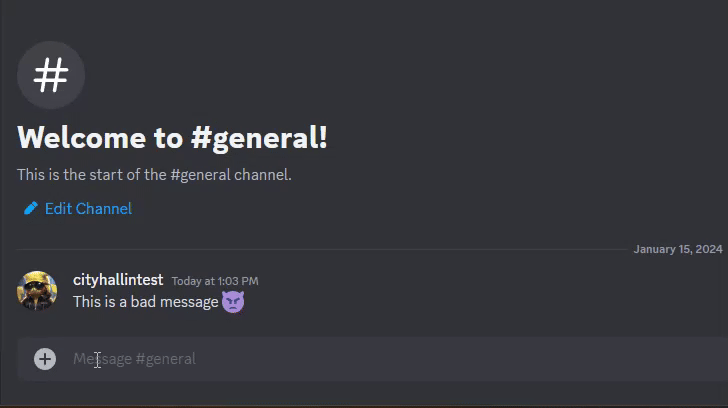
<br />


```
/moderation warn <USER_ID> <TYPE_A_REASON_FOR_THE_WARNING>
```

-  The user will receive a ping in the server that the bot has replied to their message and the offending user will be sent a DM from Carl-Bot as well.

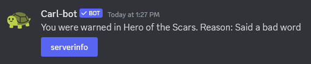
<br />

- You can add the offending message link in the **REASON** section of the command if you wish as well. This will show up in the logs and the offender's DM. 

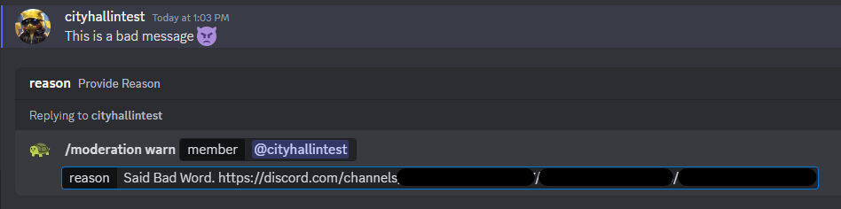
<br />

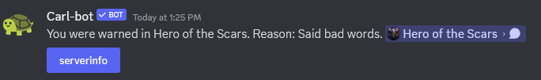
<br />

- If you'd like to check **ALL** the warnings on your server, head over to a **MODERATOR-ONLY** channel and use the Carl-Bot command:

    ```
    /moderation warns
    ```

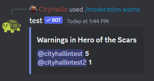
<br />

- If you'd like to check a **SPECIFIC USER's** warnings on your server, head over to a **MODERATOR-ONLY** channel and use the Carl-Bot command:

    ```
    /moderation warns <MEMBER_ID>
    ```

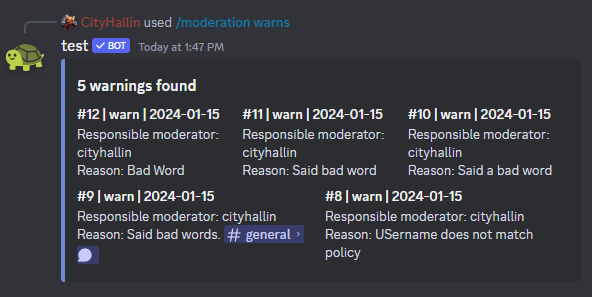
<br />

- When a warning is given. that will show up in the log channel you've configured Carl-Bot Moderation to use so all the moderators can see it.

- In the main channel with the offending message, all users will see the warning that was given and how many times that user got warned, but will not see the reason. That will only be in the server logs and in the offender's DM. 

### Timeouts <a name="timeouts"></a>
- Use the native timeout feature in Discord to restrict a users from chatting or voice calling. Right click on their user name and select **TIMEOUT**. Moderators can choose the duration and add a reason for the server logs. 

> Carl-bot has advanced features for this if you wish to use it that works the same as warns (sending the user a DM and recording it in moderator logs, but with the timeout feature). I will add that to the documentation at a later date.

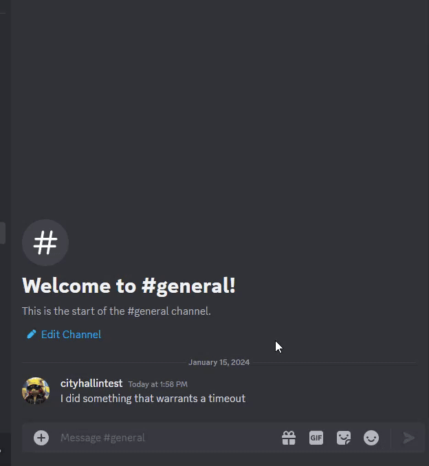
<br />

### Kicking <a name="kicking"></a>
- Kicking a user removes the user from the server, but that user can always re-join the server. In my opinion, kicking is more for troubleshooting, removing stale accounts, etc. This can be used for moderation, but in cases that may be between timeouts and banning. Simply right click on the member, select **KICK**, and provide a reason. 

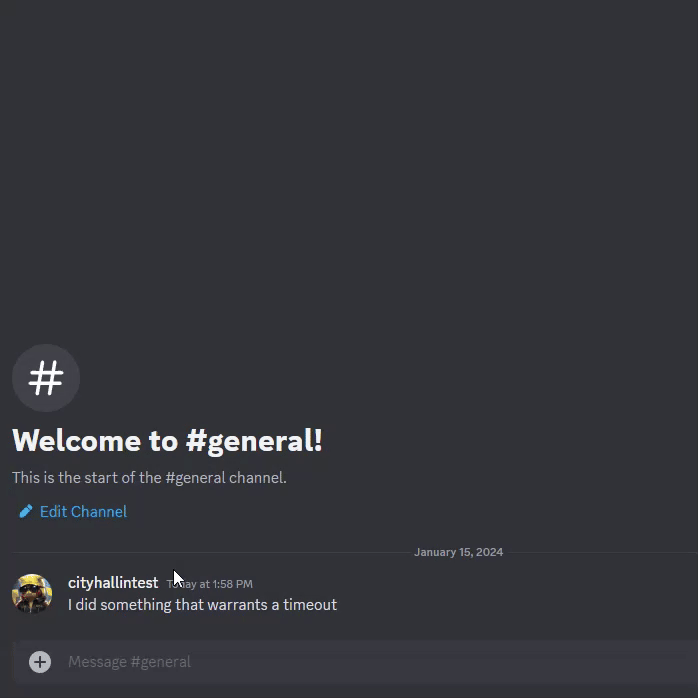
<br />

### Banning and Reporting <a name="banreport"></a>
- Banning a user will restrict them from coming back to the server. If the user simply breaks server rules and just needs to be removed from the server, a simple ban will work. If the user however needs to get reported to Discord for some example reasons below, **REPORT** the user to Discord first and then ban them. 
    - If the user account was taken over by a bad actor
    - Spam
    - Phishing attempts
    - Extremely bad behavior

- To report an extremely bad message, right click on the message and select **REPORT MESSAGE**. Go through the Report Window and select the proper description. 

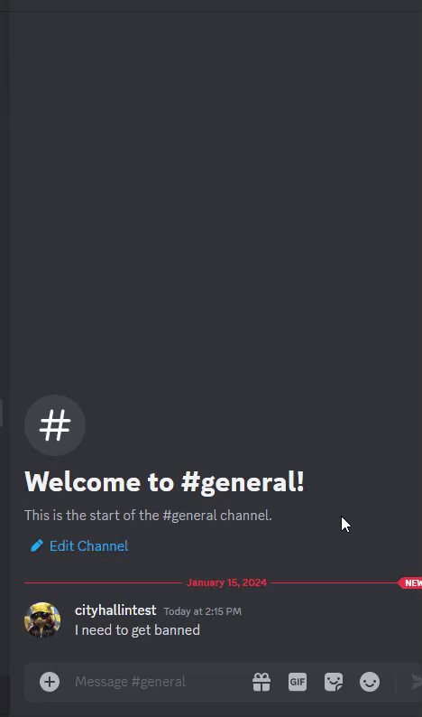
<br />

- To report a user account, click into the user's profile, select the **3 bots** on the right side, and select **REPORT USER PROFILE**. Go through the Report Window and select the proper description. 

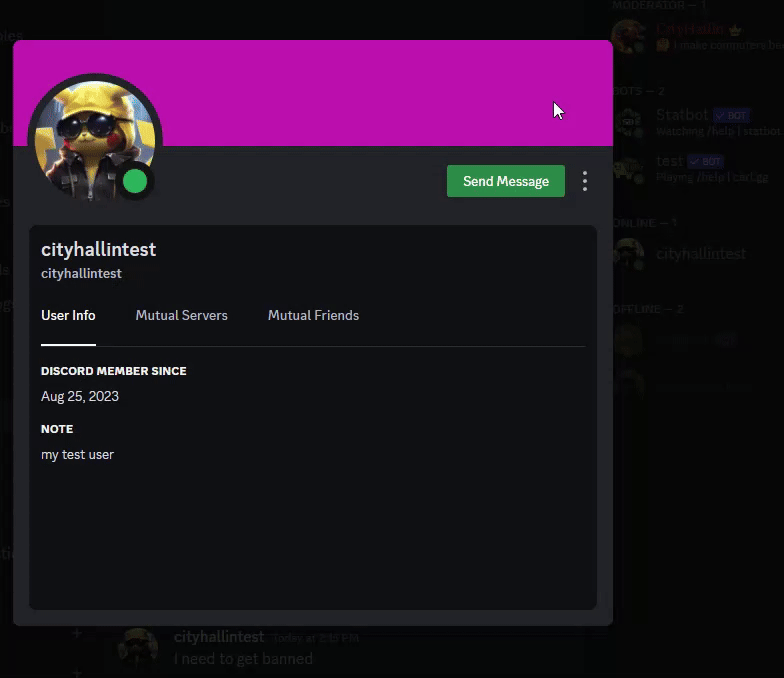
<br />

- To ban a user, right click on the user account, select **BAN** and provide a reason. 

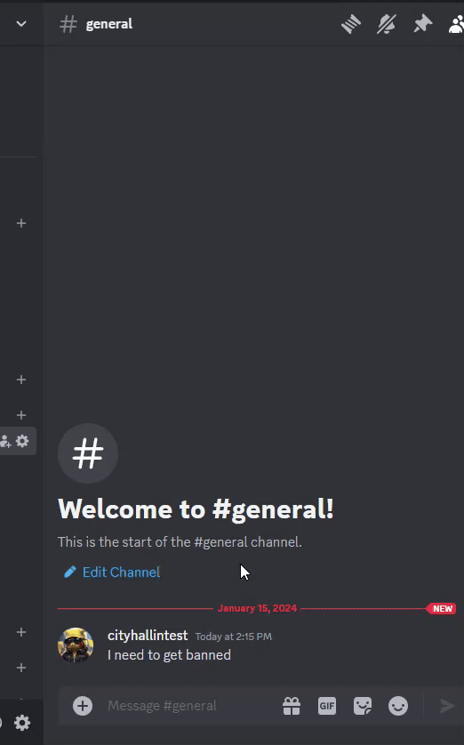
<br />

### Security Actions <a name="securityactions"></a>
- During a security event, servers have a new beta feature to temporarily halt member joins and DMs  over a period of time. **Right click on the Discord server** > **Security Actions** to use this feature. 

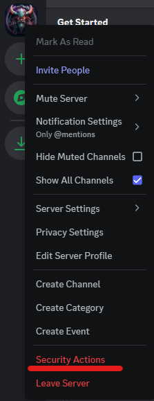
<br />

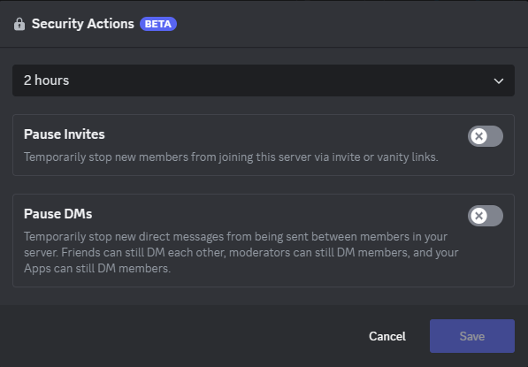
<br />
