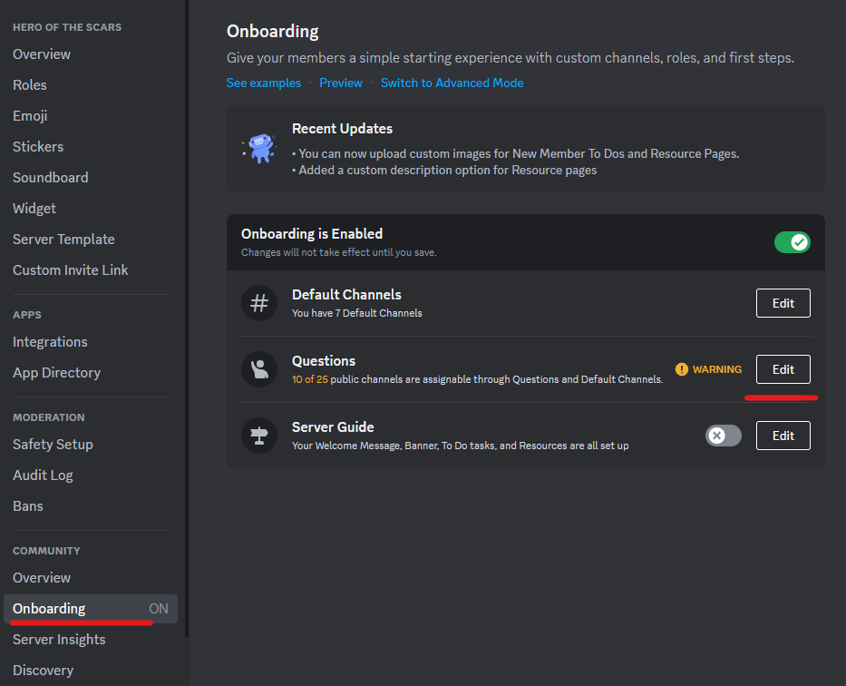

# Discord Questionnaire

- [Pre and Post Questions](#prepost)
- [Create and Update Questions](#newcreate)

## Pre and Post Questions 
Discord servers have a built in user onboarding feature called **Questions**. It allows administrations to build questionnaires that new members can answer to help tailor their experience in your Discord server. The Questions feature can be accessed in the <u>Discord Server Settings > Community > Onboarding > Questions</u> section. 

Depending on the user's answers to the questions, the questions can be set up to add certain default categories/channels to a users channels view (this just hides and un-hides channels and does not add or remove permissions to the channels) or assign the users different roles on the Discord server. 

Questions are spilt up into two sections: **Pre-Join Questions** and **Post-Join Questions**. 

### Pre-Questions
- The pre-join questions will show up in the onboarding interface when the user first tries to join the server, but before allowing them full access to the server and channels. 

 

- You can set these questions with different answers, if the question allows users to choose multiple answers, or if the question is required before the user can progress through the onboarding. 

- After the user fully completes the onboarding process through these questions, they will have visibility to the rest of the Discord server. In the **Channels & Roles** section on the server, users can see the list of pre-join questions and change their answers after the fact. 

 

### Post-Questions
- Post-join questions are the same as pre-join question, but they do not appear at all in the onboarding process. After a user is fully onboarded and joins the server, they can go into the **Channels & Roles** section and see both the pre-join and post-join questions.

## Create and Update Questions 
- Navigate to the <u>Discord Server Settings > Community > Onboarding > Questions</u> section and click **Edit**. 

 

- Click on the **Add Question** button for either the Pre-Join Question or Post-Join Question section to add a new question. Add a question title and select the **Add an Answer** button to add answers to the question. Select **Allow Multiple Answers** allowing the user to select multiple tiles or **Required** to make this a question users cannot skip (the Required selection is only available for pre-join questions).

 

- When making answers, you can select the channels that will be added to the user's view (this will only hide or un-hide channels from the user's view and will not update their permissions for the channels). You can also choose to add a user to a Discord role. One or both of these can be configured. 

 

- After your questions are made, make sure to save your Discord server configuration.

 